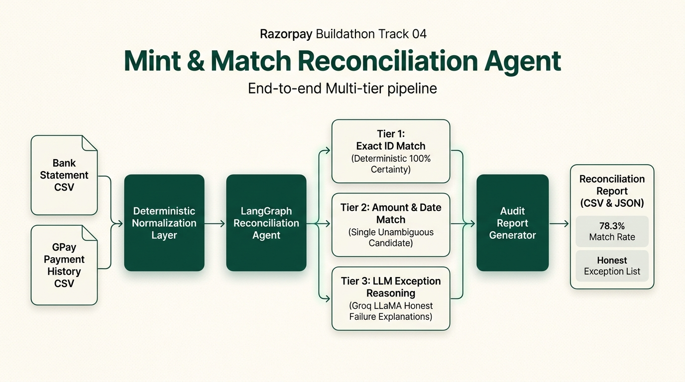
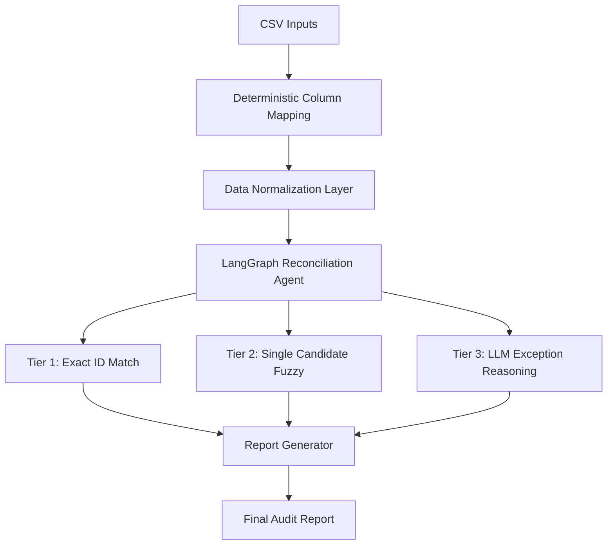

  

  # Mint & Match

  
Reconciliation you can actually trust — deterministic where certainty exists, AI only where reasoning is genuinely needed.

## The Problem

Financial reconciliation between bank statements and payment processor feeds remains a manual bottleneck because disparate column formats, truncated reference IDs, and timing discrepancies obscure matches. In finance operations, a false-positive match corrupts general ledgers and requires hours of forensic auditing, making bad automation worse than manual work. Mint & Match targets the Razorpay Buildathon Track 04 standard: high match accuracy, high throughput, and an honest exception list with clear audit trails instead of forced, erroneous matches.

## How It Works

Mint & Match enforces a strict two-stage pipeline where matches are settled with mathematical certainty and generative AI is never permitted to guess financial pairings. First, incoming feeds are deterministically mapped and normalized into canonical transaction schemas. Next, the LangGraph agent executes Tier 1 matching on exact transaction reference IDs. Remaining records pass to Tier 2, which matches on identical amount and date only when an unambiguous single candidate exists. Finally, a small Groq-hosted LLM is invoked strictly for Tier 3: generating clear, human-auditable explanations for why remaining records failed to match, without making any pairing decisions.

## Architecture

  

View Mermaid Flowchart Specification

## Why Not X

- **No RAG or vector search:** Batch transaction candidate sets are compact enough for direct memory lookups and linear date/amount indexing.
- **No two-tower or dual-encoder models:** Deep embedding networks introduce unnecessary opacity and latency for relationships better solved by rules.
- **No LLM-driven match decisions:** Generative models hallucinate under ambiguity; determinism is zero-cost, provable, and legally defensible.

## Verified Results

Tested against synthetic production-style data with known ground truth (`data/bank_statement_v3.csv` and `data/gpay_history_v3.csv`):

| Metric | Result |
| :--- | :--- |
| **Total Bank Records** | 106 |
| **Total Payment App Records** | 103 |
| **Tier 1 Matches (Exact ID)** | 68 |
| **Tier 2 Matches (Amount + Date)** | 15 |
| **Total Confirmed Matches** | 83 |
| **Tier 3 Unresolved Exceptions** | 23 |
| **Overall Match Rate** | 78.3% |
| **Processing Throughput** | 16.76 rec/s (6.32s total) |

All 23 unresolved exceptions are exported to `output/reconciliation_report.json` and `output/reconciliation_report.csv` with specific failure causes, such as cash/cheque deposits lacking UPI counterparts, internal bank interest credits, or ambiguous multi-candidate transactions sharing identical amounts on the same date.

## Conclusion

Mint & Match is built on the principle that an autonomous finance agent must be honest about its limits by design. By pairing deterministic rule-based verification with AI-driven exception explanations, it delivers a transparent reconciliation pipeline that finance teams can defend without ever debugging an AI hallucination.
